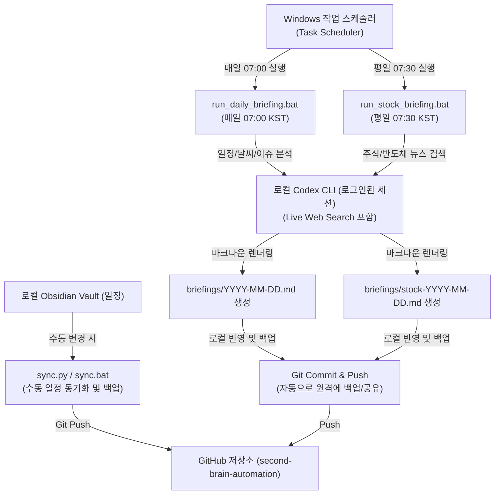

# 🤖 세컨드브레인자동화 설정 (로컬 Codex CLI 기반)

이 문서는 매일 아침 자동으로 오늘의 일정, 날씨, 주식 뉴스 브리핑을 수집해 로컬 Obsidian 볼트에 반영하고 깃허브로 백업하는 **로컬 Codex CLI 기반 세컨드브레인 자동화 시스템**의 연동 및 설정 가이드입니다.

---

## 🏗️ 시스템 구조



### 1. 데일리 일정 & 종합 브리핑 (Daily Briefing)
- **트리거**: Windows 작업 스케줄러에 의해 매일 오전 **07:00 KST** 실행.
- **파일**: [run_daily_briefing.bat](file:///C:/Users/User/Desktop/second%20brain/%EC%9E%90%EB%8F%99%ED%99%94/%EC%84%B8%EC%BB%A8%EB%93%9C%EB%B8%8C%EB%A0%88%EC%9D%B8%EC%9E%90%EB%8F%99%ED%99%94/run_daily_briefing.bat) ➡️ 로컬 `codex` CLI 호출.
- **내용**: 오늘 및 향후 7일간의 개인 일정을 분석하고, 서울 실시간 날씨와 주요 경제/IT/반도체 관련 뉴스를 요약하여 `briefings/YYYY-MM-DD.md` 생성 후 Git Push.

### 2. 주식 & 반도체 뉴스 브리핑 (Stock Briefing)
- **트리거**: Windows 작업 스케줄러에 의해 평일(월-금) 오전 **07:30 KST** 실행.
- **파일**: [run_stock_briefing.bat](file:///C:/Users/User/Desktop/second%20brain/%EC%9E%90%EB%8F%99%ED%99%94/%EC%84%B8%EC%BB%A8%EB%93%9C%EB%B8%8C%EB%A0%88%EC%9D%B8%EC%9E%90%EB%8F%99%ED%99%94/run_stock_briefing.bat) ➡️ 로컬 `codex` CLI 호출.
- **내용**: **삼성전자, SK하이닉스, 엔비디아(Nvidia), 반도체 섹터 전반**의 주요 시장 움직임, 주요 공시 및 글로벌 시황을 심층 분석/요약하여 `briefings/stock-YYYY-MM-DD.md` 생성 후 Git Push.

---

## 🛠️ 필수 사전 설정

### 1. Codex CLI 로그인 확인
본 자동화는 로컬에 로그인된 `codex` CLI 세션을 활용합니다. 별도의 API 키 관리 없이 CLI의 인증 상태를 공유하여 작동합니다.
1. 터미널(PowerShell 등)을 엽니다.
2. 아래 명령어로 현재 `codex` 로그인 상태와 헬스 체크를 확인합니다.
   ```powershell
   codex doctor
   ```
3. 로그인되어 있지 않다면 아래 명령어로 로그인을 진행해 주세요.
   ```powershell
   codex login
   ```

### 2. Windows 작업 스케줄러 등록
제공된 PowerShell 스크립트를 사용하여 백그라운드 스케줄을 손쉽게 Windows 작업 스케줄러에 등록할 수 있습니다.
1. 관리자 권한으로 PowerShell을 실행합니다.
2. 자동화 폴더(`C:\Users\User\Desktop\second brain\자동화\세컨드브레인자동화`)로 이동합니다.
3. 아래 명령어를 통해 스케줄러 등록 스크립트를 실행합니다.
   ```powershell
   Set-ExecutionPolicy Bypass -Scope Process -Force
   .\register_scheduler.ps1
   ```
4. **작업 스케줄러(Task Scheduler)** 앱을 열어 `SecondBrain_DailyBriefing` 및 `SecondBrain_StockBriefing` 작업이 올바르게 생성되었는지 확인합니다.

---

## 🚀 일상적인 사용법

### 1. 일정 수정 시 원격 동기화 (수동)
로컬 볼트의 `일정/중요 날짜.md` 또는 `일정/반복 일정.md`를 편집한 뒤, 해당 변경사항을 즉시 깃허브로 백업하거나 반영하려면 아래 스크립트를 실행합니다.
- 📂 실행 파일: [sync.bat](file:///C:/Users/User/Desktop/second%20brain/%EC%9E%90%EB%8F%99%ED%99%94/%EC%84%B8%EC%BB%A8%EB%93%9C%EB%B8%8C%EB%A0%88%EC%9D%B8%EC%9E%90%EB%8F%99%ED%99%94/sync.bat)

### 2. 타 기기(모바일 등) 및 타 PC 동기화
스케줄러에 의해 로컬에서 생성된 브리핑 파일들은 자동으로 깃허브 원격 저장소로 push됩니다. 스마트폰이나 다른 PC의 Obsidian 볼트에서 해당 브리핑을 확인하려면 **Obsidian Git** 커뮤니티 플러그인의 Pull 기능을 활용하면 편리합니다.
1. 모바일 또는 다른 기기의 Obsidian 설정 -> Community plugins -> **Obsidian Git** 활성화.
2. **Pull updates on startup** 설정을 켜서 앱을 시작할 때마다 전날이나 아침에 생성된 브리핑 노트를 자동으로 내려받도록 설정합니다.

---

## 📁 주요 구성 파일
- 🛠️ [run_daily_briefing.bat](file:///C:/Users/User/Desktop/second%20brain/%EC%9E%90%EB%8F%99%ED%99%94/%EC%84%B8%EC%BB%A8%EB%93%9C%EB%B8%8C%EB%A0%88%EC%9D%B8%EC%9E%90%EB%8F%99%ED%99%94/run_daily_briefing.bat): 매일 아침 7시 일정과 날씨, 주요 뉴스를 파싱/수집하도록 로컬 Codex CLI를 호출하고 커밋/푸시합니다.
- 📈 [run_stock_briefing.bat](file:///C:/Users/User/Desktop/second%20brain/%EC%9E%90%EB%8F%99%ED%99%94/%EC%84%B8%EC%BB%A8%EB%93%9C%EB%B8%8C%EB%A0%88%EC%9D%B8%EC%9E%90%EB%8F%99%ED%99%94/run_stock_briefing.bat): 평일 아침 7시 반에 삼성전자, SK하이닉스, 엔비디아 및 반도체 섹터 동향을 심층 분석하도록 로컬 Codex CLI를 호출하고 커밋/푸시합니다.
- ⚙️ [register_scheduler.ps1](file:///C:/Users/User/Desktop/second%20brain/%EC%9E%90%EB%8F%99%ED%99%94/%EC%84%B8%EC%BB%A8%EB%93%9C%EB%B8%8C%EB%A0%88%EC%9D%B8%EC%9E%90%EB%8F%99%ED%99%94/register_scheduler.ps1): 작업 스케줄러 등록을 위한 PowerShell 스케줄 생성기.
- 📂 [sync.py](file:///C:/Users/User/Desktop/second%20brain/%EC%9E%90%EB%8F%99%ED%99%94/%EC%84%B8%EC%BB%A8%EB%93%9C%EB%B8%8C%EB%A0%88%EC%9D%B8%EC%9E%90%EB%8F%99%ED%99%94/sync.py): 로컬 일정 데이터를 동기화하는 백업/복사용 코어 파이썬 스크립트.
