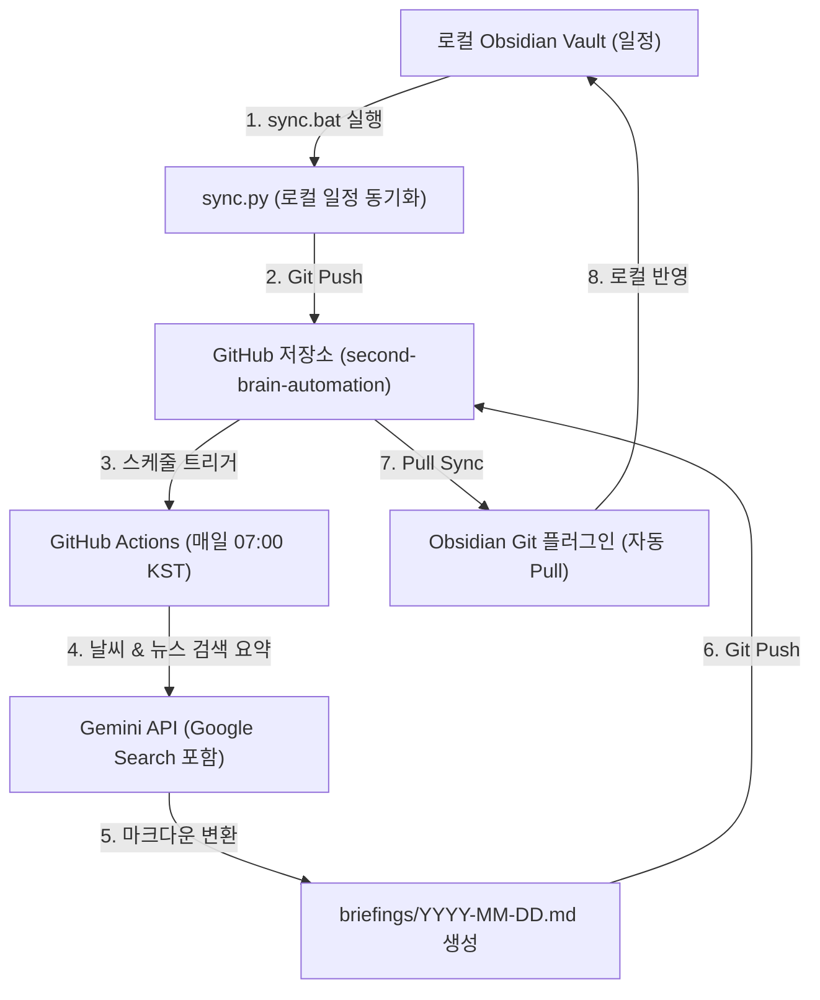

# 🤖 세컨드브레인자동화 설정

이 문서는 매일 아침 자동으로 오늘의 일정, 날씨, 관심 뉴스를 수집해 Obsidian 볼트에 반영하는 **세컨드브레인 자동화 시스템**의 연동 및 설정 가이드입니다.

---

## 🏗️ 시스템 구조

1. **로컬 일정 동기화**: 로컬 볼트에서 일정을 수정하면, `sync.bat`을 실행해 [second-brain-automation](https://github.com/sisayousm-beep/second-brain-automation) 원격 저장소의 `data/` 폴더에 일정을 복사하고 커밋&푸시합니다.
2. **클라우드 자동 브리핑 생성**: 매일 오전 07:00 KST에 GitHub Actions가 자동으로 켜져, 동기화된 일정을 읽고 **Gemini API**를 통해 실시간 날씨 및 구글 검색 기반 최신 반도체/IT 뉴스를 수집한 후 브리핑 마크다운 노트를 생성합니다.
3. **볼트 동기화**: 생성된 데일리 브리핑은 깃허브 저장소에 푸시되며, 로컬 Obsidian Git 플러그인 또는 git pull 명령을 통해 로컬 볼트로 자동 반영됩니다.

---

## 🛠️ 필수 사전 설정

### 1. GitHub Secrets에 Gemini API Key 등록 (필수)
실시간 날씨 검색 및 구글 뉴스 요약 기능을 사용하려면 Gemini API Key가 필요합니다.
1. [Google AI Studio](https://aistudio.google.com/)에서 API Key를 발급받습니다. (무료 이용 가능)
2. 본인의 깃허브 저장소 [second-brain-automation](https://github.com/sisayousm-beep/second-brain-automation)으로 이동합니다.
3. **Settings** -> **Secrets and variables** -> **Actions** 메뉴로 들어갑니다.
4. **New repository secret** 버튼을 클릭합니다.
5. 아래 정보를 입력하고 저장합니다:
   - **Name**: `GEMINI_API_KEY`
   - **Value**: *발급받은 Gemini API Key 입력*

### 2. GitHub Actions Write 권한 확인
GitHub Actions가 브리핑 노트를 작성한 뒤 원격 저장소에 직접 커밋/푸시할 수 있도록 쓰기 권한이 필요합니다.
1. 깃허브 저장소 **Settings** -> **Actions** -> **General**로 이동합니다.
2. 하단의 **Workflow permissions** 섹션을 찾습니다.
3. **Read and write permissions** 옵션을 선택하고 저장합니다.

---

## 🚀 일상적인 사용법

### 1. 일정 수정 시 원격 동기화
로컬 볼트의 `일정/중요 날짜.md` 또는 `일정/반복 일정.md`를 편집했다면, 아래 파일을 더블클릭하여 동기화합니다.
- 📂 실행 파일: [sync.bat](file:///C:/Users/User/Desktop/second%20brain/%EC%9E%90%EB%8F%99%ED%99%94/%EC%84%B8%EC%BB%A8%EB%93%9C%EB%B8%8C%EB%A0%88%EC%9D%B8%EC%9E%90%EB%8F%99%ED%99%94/sync.bat)
- *이 스크립트는 백그라운드에서 안전하게 인코딩 오류 없이 중요 일정들을 깃허브로 업로드합니다.*

### 2. Obsidian 로컬 자동 Pull 설정 (Obsidian Git 플러그인 추천)
매일 아침 깃허브에서 생성된 브리핑 노트를 로컬 볼트로 자동으로 pull해 오기 위해 **Obsidian Git** 커뮤니티 플러그인 설정을 추천합니다.
1. Obsidian 설정 -> Community plugins -> **Obsidian Git** 활성화.
2. 플러그인 설정 항목 중 **Vault backup interval (minutes)** 또는 **Pull updates on startup** 설정을 활성화하여, Obsidian을 열 때 자동으로 최신 브리핑 파일을 원격에서 로컬로 가져오도록 세팅합니다.
3. 수동으로 풀(pull)하려면 Obsidian 명령 팔레트(`Ctrl + P`)에서 `Obsidian Git: Pull`을 실행하면 즉시 가져옵니다.

---

## 📁 주요 구성 파일
- 🛠️ [sync.py](file:///C:/Users/User/Desktop/second%20brain/%EC%9E%90%EB%8F%99%ED%99%94/%EC%84%B8%EC%BB%A8%EB%93%9C%EB%B8%8C%EB%A0%88%EC%9D%B8%EC%9E%90%EB%8F%99%ED%99%94/sync.py): 로컬 일정을 추적 복사하고 깃허브로 푸시하는 파이썬 코어.
- ⚙️ [daily-briefing.yml](file:///C:/Users/User/Desktop/second%20brain/%EC%9E%90%EB%8F%99%ED%99%94/%EC%84%B8%EC%BB%A8%EB%93%9C%EB%B8%8C%EB%A0%88%EC%9D%B8%EC%9E%90%EB%8F%99%ED%99%94/.github/workflows/daily-briefing.yml): 매일 오전 7시 KST에 트리거되는 깃허브 액션 스크립트.
- 🧠 [briefing.py](file:///C:/Users/User/Desktop/second%20brain/%EC%9E%90%EB%8F%99%ED%99%94/%EC%84%B8%EC%BB%A8%EB%93%9C%EB%B8%8C%EB%A0%88%EC%9D%B8%EC%9E%90%EB%8F%99%ED%99%94/src/briefing.py): 일정 파싱 및 Gemini API를 호출해 최종 브리핑 마크다운을 렌더링하는 소스코드.
