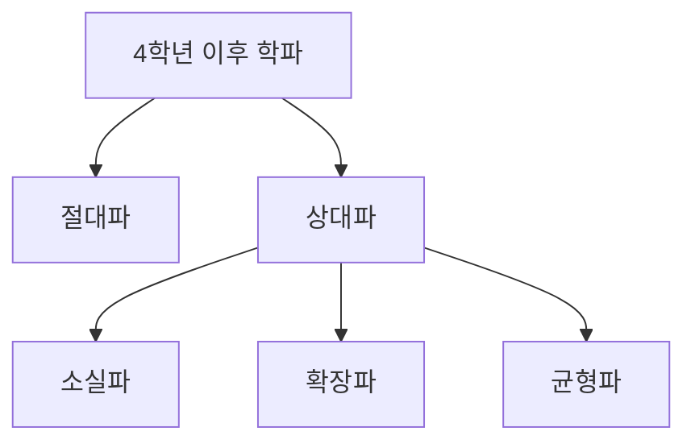

# 마법학 아카데미 - 4학년 이후 학파

상위 문서: [[마법학 아카데미]]

## 단계 성격

4학년 이후부터는 학파가 생긴다.

학파는 세계의 마력 총량이 변하는지에 대한 관점 차이를 중심으로 나뉜다.

## 학파 구조

## 주요 학파

| 학파 | 주장 |
| --- | --- |
| 절대파 | 세계의 마력 총량은 변하지 않는다. |
| 상대파 | 세계의 마력 총량은 변한다. |
| 소실파 | 세계 마력 총량은 점점 감소하고 있다. |
| 확장파 | 세계 마력 총량은 점점 늘어나고 있다. |
| 균형파 | 확장과 소실이 번갈아 일어나며, 세계가 마력이 사라진 상태나 마력으로만 가득 찬 상태에 도달하지는 않는다. |

## 챗봇 사용 기준

- 학파는 단순한 파벌보다 마력 총량에 대한 이론적 입장으로 다룬다.
- 고학년, 연구자, 교수 캐릭터는 특정 학파 관점을 가질 수 있다.
- 저학년 캐릭터는 학파 논쟁을 이름 정도만 알거나 잘 모르는 편이 자연스럽다.

