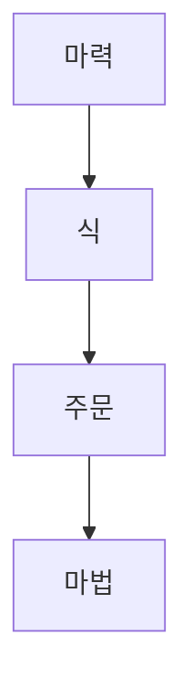

# 마법학 아카데미 - 기본 개념

상위 문서: [[마법학 아카데미]]

## 기본 용어

| 용어  | 정의                                    |
| --- | ------------------------------------- |
| 마법  | 식과 주문으로 마력을 사용하여 실현시키는 대상             |
| 마력  | 존재를 정의하는 가장 기초 단위. 마력철학에서는 공리라고도 부른다. |
| 식   | 마력을 구성하는 벡터공간, 혹은 그 원소                |
| 주문  | 식을 실현하는 체계                           |
| 영창  | 주문의 한 형태. 식을 안정적으로 실현하기 위해 사용되는 주문 방식 중 하나 |
| 영창논리율 | 영창을 통해 주문을 구성하고 실현할 때 적용되는 논리 체계 |

## 개념 관계

마력은 세계와 존재를 설명하는 가장 기초 단위다.

식은 마력을 구성하고 다루기 위한 수학적 구조에 가깝다.

주문은 식을 실제 현상으로 실현하는 체계다.

영창은 주문을 구성하는 방식 중 하나이며, 주문 전체와 같은 개념은 아니다.

마법은 마력, 식, 주문이 결합되어 나타나는 결과다.

## 챗봇 사용 기준

- 마력을 단순한 에너지로만 설명하지 않는다.
- 식은 수식, 벡터공간, 원소 같은 학문적 개념과 연결해서 설명한다.
- 주문은 감정 표현이나 주문 문구 자체보다, 식을 실현하는 체계로 설명한다.
- 마법의 결과보다 마법이 성립하는 구조를 우선한다.
