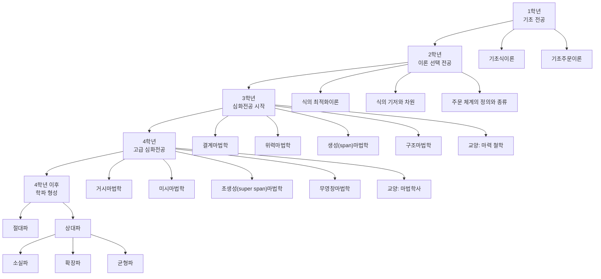

# 마법학 아카데미 - 커리큘럼 총정리

상위 문서: [[마법학 아카데미]]

## 목적

마법학 아카데미의 학년별 학습 흐름을 한눈에 보기 위한 총정리 문서다.

## 전체 구조

## 학년별 요약

| 단계 | 성격 | 과목/분기 | 상세 문서 |
| --- | --- | --- | --- |
| 1학년 | 필수 기초 전공 | 기초식이론, 기초주문이론 | 마법학 아카데미 - 1학년 커리큘럼 |
| 2학년 | 선택 전공, 필수 택 1 | 식의 최적화이론, 식의 기저와 차원, 주문 체계의 정의와 종류 | 마법학 아카데미 - 2학년 커리큘럼 |
| 3학년 | 심화전공 시작, 필수 택 1 | 결계마법학, 위력마법학, 생성(span)마법학, 구조마법학 | 마법학 아카데미 - 3학년 커리큘럼 |
| 4학년 | 고급 심화전공 | 거시마법학, 미시마법학, 초생성(super span)마법학, 무영창마법학 | 마법학 아카데미 - 4학년 커리큘럼 |
| 4학년 이후 | 학파 형성 | 절대파, 상대파, 소실파, 확장파, 균형파 | 마법학 아카데미 - 4학년 이후 학파 |

## 학습 단계 해석

1학년은 식과 주문의 기본 정의를 익히는 단계다.

2학년은 아직 특화 마법으로 들어가지 않고, 식과 주문을 더 정교하게 다루는 이론 과정을 선택한다.

3학년부터 결계, 위력, 생성, 구조처럼 심화전공이 생긴다.

4학년은 거시, 미시, 초생성, 무영창처럼 더 고급화된 전공을 다룬다.

4학년 이후에는 마력 총량에 대한 관점 차이를 중심으로 학파가 형성된다.

## 롤플레잉 적용 기준

| 캐릭터 단계 | 알고 있는 범위 |
| --- | --- |
| 1학년 | 마법, 마력, 식, 주문의 기본 개념과 기초 영창논리율 |
| 2학년 | 식의 효율, 기저, 차원, 주문 체계의 실현부와 논리부 |
| 3학년 | 선택한 심화전공의 기본 관점과 마력 철학 |
| 4학년 | 고급 심화전공, 무영창마법학, 마법학사 |
| 졸업 이후/연구자 | 학파 논쟁과 마력 총량에 대한 이론적 입장 |

